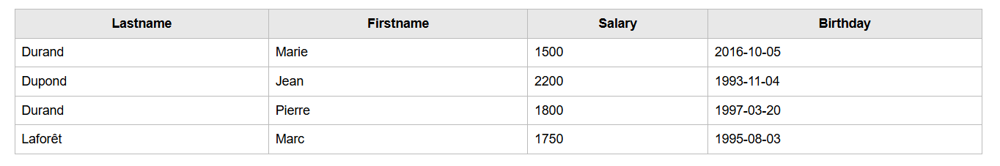

# JSON REQUEST
### v1.0
## Query a simple standard JSON file (from One table MySQL export)**

**Usage**

```php
require_once('JsonRequest.php');
$datas = new JsonRequest('users.json');
echo $datas->showDatas();
```




**Methods**

filter(String $field, Mixed $value, String $comparator = '==', Bool $case_sensitive = false, Mixed $source = null): object
**By default, source is current complete file, but you can use a filtered result**

*supported comparators*
      - ==
      - LIKE
      - >
      - >=
      -  <
      -  <=
      -  BETWEEN ( value must be array [min,max] , inclusive)

sort(String $field, String $direction = 'ASC', Mixed &$source = null): object

showDatas(array $onlycolumns = array(), Bool $reset = false): String

*Output html table with class "jsonrequest" to stylize in css

```css
.jsonrequest{
    border-collapse: collapse;
    width:100%;
    font-family: serif;
}

.jsonrequest td, .jsonrequest th {
    border:1px solid #bbb;
    padding:8px;
}
```